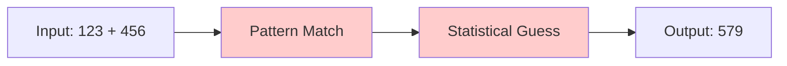
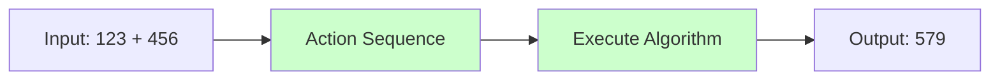

<p align="center">
  
  
  
  
  
</p>

<h1 align="center">
  
</h1>

<h3 align="center">
  <i>Beyond Next-Token Prediction → True Computational Learning</i>
</h3>

<p align="center">
  <b>A Novel Neural Architecture That Learns Actions, Not Patterns</b>
</p>

<p align="center">
  <a href="#-overview">Overview</a> •
  <a href="#-the-problem">The Problem</a> •
  <a href="#-architecture">Architecture</a> •
  <a href="#-installation">Installation</a> •
  <a href="#-quick-start">Quick Start</a> •
  <a href="#-documentation">Documentation</a>
</p>

---

<br>

<div align="center">
  
</div>

<!-- ═══════════════════════════════════════════════════════════════════════ -->
<!--                           👤 LEAD RESEARCHER                            -->
<!-- ═══════════════════════════════════════════════════════════════════════ -->

<table align="center">
<tr>
<td width="50%" valign="center" align="center">

### 👨‍🔬 Lead Researcher


<br><br>

**Visionary behind Actformer**

Pioneering the next generation of neural architectures that learn genuine computation rather than pattern matching.

<br>

<a href="mailto:abhishek.aimarine@gmail.com">
  
</a>

</td>
<td width="50%" valign="center" align="center">

### 🏛️ Research Initiative


<br><br>

**Open Source Research Project**

Building the foundation for AI systems that truly understand computation and can generalize algorithms to any scale.

<br>

<a href="https://github.com">
  
</a>

</td>
</tr>
</table>

<br>

<!-- ═══════════════════════════════════════════════════════════════════════ -->
<!--                              📖 TABLE OF CONTENTS                       -->
<!-- ═══════════════════════════════════════════════════════════════════════ -->

<details>
<summary><h2>📑 Table of Contents</h2></summary>

- [📖 Overview](#-overview)
- [❓ The Problem with Transformers](#-the-problem-with-transformers)
- [💡 Our Solution: Action-Based Learning](#-our-solution-action-based-learning)
- [🏗️ Architecture](#-architecture)
  - [Core Design Principles](#-core-design-principles)
  - [System Architecture](#-system-architecture)
  - [Component Breakdown](#-component-breakdown)
- [⚙️ Installation](#️-installation)
- [🚀 Quick Start](#-quick-start)
- [📚 Documentation](#-documentation)
  - [Action Space](#-action-space)
  - [Working Memory](#-working-memory)
  - [Action Execution Engine](#-action-execution-engine)
  - [Training Paradigm](#-training-paradigm)
- [🧪 Examples](#-examples)
- [📊 Benchmarks](#-benchmarks)
- [🗺️ Roadmap](#️-roadmap)
- [🤝 Contributing](#-contributing)
- [📄 License](#-license)
- [🙏 Acknowledgments](#-acknowledgments)

</details>

<br>

<!-- ═══════════════════════════════════════════════════════════════════════ -->
<!--                              📖 OVERVIEW                                -->
<!-- ═══════════════════════════════════════════════════════════════════════ -->

<h2 align="center">📖 Overview</h2>

<p align="center">
  
</p>

<table align="center">
<tr>
<td width="100%">

**Actformer** is a revolutionary neural network architecture that fundamentally reimagines how machines learn computation. Unlike Transformers that predict next tokens through attention mechanisms without truly learning underlying operations, **Actformers learn and predict actions** — discrete computational steps that transform state.

</td>
</tr>
</table>

<br>

<table align="center">
<tr>
<th width="33%" align="center">🧠 <b>Learn</b></th>
<th width="33%" align="center">⚡ <b>Execute</b></th>
<th width="33%" align="center">🚀 <b>Generalize</b></th>
</tr>
<tr>
<td align="center">

Genuine algorithms instead of surface patterns

</td>
<td align="center">

Actions that transform computational state

</td>
<td align="center">

Perfect extrapolation to any scale

</td>
</tr>
</table>

<br>

<!-- ═══════════════════════════════════════════════════════════════════════ -->
<!--                     ❓ THE PROBLEM WITH TRANSFORMERS                    -->
<!-- ═══════════════════════════════════════════════════════════════════════ -->

<h2 align="center">❓ The Problem with Transformers</h2>

<br>

<table align="center">
<tr>
<td width="50%" align="center">

### 🔴 **Transformer Approach**



</td>
<td width="50%" align="center">

### 🟢 **Actformer Approach**



</td>
</tr>
<tr>
<td align="center">

❌ **FAILS** on numbers larger than training distribution

</td>
<td align="center">

✅ **WORKS** on numbers of **ANY** size

</td>
</tr>
</table>

<br>

<h3 align="center">🎯 The Core Issue</h3>

<table align="center">
<tr>
<td>

```
┌─────────────────────────────────────────────────────────────────────────────┐
│                                                                             │
│   ┌─────────────────────────────────────────────────────────────────────┐   │
│   │                                                                     │   │
│   │   TRANSFORMERS do NOT learn to COMPUTE                              │   │
│   │   ─────────────────────────────────────                             │   │
│   │                                                                     │   │
│   │   They learn to PATTERN-MATCH                                       │   │
│   │                                                                     │   │
│   │   When asked to add 20-digit numbers:                               │   │
│   │                                                                     │   │
│   │   ✗ They have NOT learned addition                                  │   │
│   │   ✗ They retrieve statistically probable continuations              │   │
│   │   ✗ They FAIL catastrophically on out-of-distribution inputs        │   │
│   │                                                                     │   │
│   └─────────────────────────────────────────────────────────────────────┘   │
│                                                                             │
│   ┌─────────────────────────────────────────────────────────────────────┐   │
│   │                                                                     │   │
│   │   ACTFORMERS learn to COMPUTE                                       │   │
│   │   ─────────────────────────                                         │   │
│   │                                                                     │   │
│   │   They learn to EXECUTE ALGORITHMS                                  │   │
│   │                                                                     │   │
│   │   When asked to add ANY-digit numbers:                              │   │
│   │                                                                     │   │
│   │   ✓ They have learned the addition algorithm                        │   │
│   │   ✓ They execute discrete computational actions                     │   │
│   │   ✓ They GENERALIZE perfectly to any input size                     │   │
│   │                                                                     │   │
│   └─────────────────────────────────────────────────────────────────────┘   │
│                                                                             │
└─────────────────────────────────────────────────────────────────────────────┘
```

</td>
</tr>
</table>

<br>

<!-- ═══════════════════════════════════════════════════════════════════════ -->
<!--                    💡 OUR SOLUTION: ACTION-BASED LEARNING               -->
<!-- ═══════════════════════════════════════════════════════════════════════ -->

<h2 align="center">💡 Our Solution: Action-Based Learning</h2>

<br>

<div align="center">

```
╔═══════════════════════════════════════════════════════════════════════════════╗
║                                                                               ║
║     ┌─────────────────────┐              ┌─────────────────────┐              ║
║     │                     │              │                     │              ║
║     │    TOKEN-BASED      │      →       │    ACTION-BASED     │              ║
║     │    ────────────     │              │    ────────────     │              ║
║     │                     │              │                     │              ║
║     │  Predict next word  │              │ Predict next action │              ║
║     │                     │              │                     │              ║
║     └─────────────────────┘              └─────────────────────┘              ║
║                                                                               ║
║                         ═════════════════════════                            ║
║                                                                               ║
║           Token:      "579"         Action:      READ digit → ADD → WRITE    ║
║           Learns:     Patterns      Learns:      Algorithms                   ║
║           Outcome:    Limited       Outcome:     Unlimited                    ║
║                                                                               ║
╚═══════════════════════════════════════════════════════════════════════════════╝
```

</div>

<br>

<h3 align="center">🎬 What is an Action?</h3>

<table align="center">
<tr>
<td>

An **Action** is a discrete computational operation that transforms the current state of a problem:

```
┌──────────────────────────────────────────────────────────────────────────────┐
│                          ACTION EXAMPLES                                      │
├──────────────────────────────────────────────────────────────────────────────┤
│                                                                              │
│   📖 READ      → Read digit from position i                                  │
│   ➕ ADD       → Compute sum of two values                                   │
│   🔢 CARRY    → Determine and store carry bit                                │
│   ✏️ WRITE    → Write result digit to output                                 │
│   ➡️ ADVANCE  → Move to next position                                        │
│   🛑 HALT     → Stop computation                                             │
│                                                                              │
└──────────────────────────────────────────────────────────────────────────────┘
```

**The Key Insight:**
> Actions learned on small numbers transfer **perfectly** to numbers of any size because the underlying algorithm is **identical**.

</td>
</tr>
</table>

<br>

<!-- ═══════════════════════════════════════════════════════════════════════ -->
<!--                              🏗️ ARCHITECTURE                            -->
<!-- ═══════════════════════════════════════════════════════════════════════ -->

<h2 align="center">🏗️ Architecture</h2>

<br>

<h3 align="center">🎯 Core Design Principles</h3>

<br>

<table align="center">
<tr>
<td width="50%" align="center">

### 1️⃣ Action-Centric Learning
```
┌─────────────────────────────┐
│  Predict ACTIONS            │
│  Not TOKENS                 │
│  ───────────────            │
│  Learn computational        │
│  procedures, not            │
│  surface patterns           │
└─────────────────────────────┘
```

</td>
<td width="50%" align="center">

### 2️⃣ Explicit State Management
```
┌─────────────────────────────┐
│  Observable & Modifiable    │
│  Working Memory             │
│  ─────────────────────      │
│  Direct state access        │
│  for systematic execution   │
└─────────────────────────────┘
```

</td>
</tr>
<tr>
<td width="50%" align="center">

### 3️⃣ Differentiable Operations
```
┌─────────────────────────────┐
│  End-to-End Training        │
│  via Gradient Descent       │
│  ─────────────────────      │
│  All operations support     │
│  backpropagation            │
└─────────────────────────────┘
```

</td>
<td width="50%" align="center">

### 4️⃣ Compositional Generalization
```
┌─────────────────────────────┐
│  Actions Transfer to        │
│  Novel Problems             │
│  ─────────────────────      │
│  Systematic generalization  │
│  beyond training data       │
└─────────────────────────────┘
```

</td>
</tr>
</table>

<br>

<h3 align="center">🏛️ System Architecture</h3>

<br>

<div align="center">

```
 ╔═══════════════════════════════════════════════════════════════════════════════╗
 ║                              A C T F O R M E R                                 ║
 ╠═══════════════════════════════════════════════════════════════════════════════╣
 ║                                                                               ║
 ║    ┌──────────────────────────────────────────────────────────────────────┐   ║
 ║    │                         INPUT ENCODER                                 │   ║
 ║    │                     Problem → Initial State                          │   ║
 ║    └──────────────────────────────────────────────────────────────────────┘   ║
 ║                                    │                                          ║
 ║                                    ▼                                          ║
 ║    ┌──────────────────────────────────────────────────────────────────────┐   ║
 ║    │                                                                      │   ║
 ║    │  ┌─────────────────┐         ┌─────────────────────────────────┐    │   ║
 ║    │  │                 │         │                                 │    │   ║
 ║    │  │  ACTION SPACE   │         │       WORKING MEMORY            │    │   ║
 ║    │  │  ─────────────  │         │       ─────────────             │    │   ║
 ║    │  │                 │         │                                 │    │   ║
 ║    │  │  • Primitives   │◄───────►│  ┌─────────────────────────┐   │    │   ║
 ║    │  │    READ, WRITE  │         │  │     REGISTER FILE       │   │    │   ║
 ║    │  │    ADD, SUB...  │         │  │     ─────────────       │   │    │   ║
 ║    │  │                 │         │  │     R0  R1  R2  ... Rn  │   │    │   ║
 ║    │  │  • Memory Ops   │         │  └─────────────────────────┘   │    │   ║
 ║    │  │    LOAD, STORE  │         │                                 │    │   ║
 ║    │  │    PTR_MOVE     │         │  ┌─────────────────────────┐   │    │   ║
 ║    │  │                 │         │  │     SCRATCHPAD          │   │    │   ║
 ║    │  │  • Control Flow │         │  │     ──────────          │   │    │   ║
 ║    │  │    IF, LOOP     │         │  │     [Addressable Mem]   │   │    │   ║
 ║    │  │                 │         │  └─────────────────────────┘   │    │   ║
 ║    │  │  • Meta Ops     │         │                                 │    │   ║
 ║    │  │    HALT, OUTPUT │         │  ┌─────────────────────────┐   │    │   ║
 ║    │  │                 │         │  │     POINTER NETWORK     │   │    │   ║
 ║    │  └─────────────────┘         │  │     ───────────────     │   │    │   ║
 ║    │                              │  │     P0  P1  P2  ...    │   │    │   ║
 ║    │                              │  └─────────────────────────┘   │    │   ║
 ║    │                              │                                 │    │   ║
 ║    └─────────────────────────────────────────────────────────────────┘    │   ║
 ║                                    │                                          ║
 ║                                    ▼                                          ║
 ║    ┌──────────────────────────────────────────────────────────────────────┐   ║
 ║    │                                                                      │   ║
 ║    │                       ACTION PREDICTOR                                │   ║
 ║    │                       ────────────────                                │   ║
 ║    │                                                                      │   ║
 ║    │    ┌─────────────────────────────────────────────────────────────┐   │   ║
 ║    │    │                                                             │   │   ║
 ║    │    │   ┌───────────────┐      ┌─────────────────────────────┐   │   │   ║
 ║    │    │   │  STATE        │      │  HISTORY                    │   │   │   ║
 ║    │    │   │  ATTENTION    │      │  ATTENTION                  │   │   │   ║
 ║    │    │   │  ──────────   │      │  ──────────                 │   │   │   ║
 ║    │    │   │  Over Memory  │      │  Over Past Actions          │   │   │   ║
 ║    │    │   └───────┬───────┘      └──────────────┬──────────────┘   │   │   ║
 ║    │    │           │                             │                  │   │   ║
 ║    │    │           └─────────────┬───────────────┘                  │   │   ║
 ║    │    │                         │                                  │   │   ║
 ║    │    │                         ▼                                  │   │   ║
 ║    │    │           ┌─────────────────────────────┐                  │   │   ║
 ║    │    │           │   MLP → ACTION LOGITS       │                  │   │   ║
 ║    │    │           │   π(a | state, history)     │                  │   │   ║
 ║    │    │           └─────────────────────────────┘                  │   │   ║
 ║    │    │                                                             │   │   ║
 ║    │    └─────────────────────────────────────────────────────────────┘   │   ║
 ║    │                                                                      │   ║
 ║    └──────────────────────────────────────────────────────────────────────┘   ║
 ║                                    │                                          ║
 ║                                    ▼                                          ║
 ║    ┌──────────────────────────────────────────────────────────────────────┐   ║
 ║    │                                                                      │   ║
 ║    │                     ACTION EXECUTION ENGINE                           │   ║
 ║    │                     ───────────────────────                           │   ║
 ║    │                                                                      │   ║
 ║    │   ┌────────────────────────┐    ┌────────────────────────┐          │   ║
 ║    │   │                        │    │                        │          │   ║
 ║    │   │    SYMBOLIC OPS        │    │    NEURAL OPS          │          │   ║
 ║    │   │    ────────────        │    │    ───────────         │          │   ║
 ║    │   │                        │    │                        │          │   ║
 ║    │   │    • ADD (exact)       │    │    • Pattern match     │          │   ║
 ║    │   │    • MULTIPLY (exact)  │    │    • Judgment calls    │          │   ║
 ║    │   │    • COMPARE (soft)    │    │    • Learned behaviors │          │   ║
 ║    │   │                        │    │                        │          │   ║
 ║    │   │    ✓ Guaranteed        │    │    ✓ Flexible          │          │   ║
 ║    │   │      correctness       │    │      adaptation        │          │   ║
 ║    │   │                        │    │                        │          │   ║
 ║    │   └────────────────────────┘    └────────────────────────┘          │   ║
 ║    │                                                                      │   ║
 ║    └──────────────────────────────────────────────────────────────────────┘   ║
 ║                                    │                                          ║
 ║                                    ▼                                          ║
 ║    ┌──────────────────────────────────────────────────────────────────────┐   ║
 ║    │                         OUTPUT DECODER                                │   ║
 ║    │                     Final State → Result                              │   ║
 ║    └──────────────────────────────────────────────────────────────────────┘   ║
 ║                                                                               ║
 ╚═══════════════════════════════════════════════════════════════════════════════╝
```

</div>

<br>

<h3 align="center">🔧 Component Breakdown</h3>

<br>

<table align="center">
<tr>
<th align="center" width="25%">Component</th>
<th align="center" width="35%">Function</th>
<th align="center" width="40%">Key Innovation</th>
</tr>
<tr>
<td align="center">

**Action Space**

</td>
<td>

Defines vocabulary of computational operations

</td>
<td>

Hierarchical, learnable action tokens with compositional semantics

</td>
</tr>
<tr>
<td align="center">

**Working Memory**

</td>
<td>

Maintains explicit state during computation

</td>
<td>

Differentiable read/write with attention-based addressing

</td>
</tr>
<tr>
<td align="center">

**Action Predictor**

</td>
<td>

Predicts next action given context and state

</td>
<td>

Dual attention over action history and memory state

</td>
</tr>
<tr>
<td align="center">

**Execution Engine**

</td>
<td>

Implements action semantics and state transitions

</td>
<td>

Hybrid symbolic-neural execution for correctness + flexibility

</td>
</tr>
</table>

<br>

<!-- ═══════════════════════════════════════════════════════════════════════ -->
<!--                            ⚙️ INSTALLATION                              -->
<!-- ═══════════════════════════════════════════════════════════════════════ -->

<h2 align="center">⚙️ Installation</h2>

<br>

<div align="center">

[](https://pytorch.org/)
[](https://python.org/)

</div>

<br>

<h3 align="center">📦 Requirements</h3>

<table align="center">
<tr>
<td>

```bash
# Core dependencies
torch>=2.0.0
numpy>=1.21.0

# Optional but recommended
matplotlib>=3.5.0    # for visualization
tqdm>=4.64.0         # for progress bars
tensorboard>=2.9.0   # for logging
```

</td>
</tr>
</table>

<h3 align="center">🚀 Install from Source</h3>

<table align="center">
<tr>
<td>

```bash
# Clone the repository
git clone https://github.com/your-username/actformer.git

# Navigate to project directory
cd actformer

# Install in development mode
pip install -e .

# Or install dependencies directly
pip install -r requirements.txt
```

</td>
</tr>
</table>

<br>

<!-- ═══════════════════════════════════════════════════════════════════════ -->
<!--                            🚀 QUICK START                               -->
<!-- ═══════════════════════════════════════════════════════════════════════ -->

<h2 align="center">🚀 Quick Start</h2>

<br>

<h3 align="center">🎬 Basic Usage</h3>

<table align="center">
<tr>
<td>

```python
import torch
from actformer import Actformer, AdditionTaskDataset, train_actformer

# ═══════════════════════════════════════════════════════════════════════
# 🏗️ Create the Model
# ═══════════════════════════════════════════════════════════════════════
model = Actformer(
    num_registers=16,      # Number of registers in working memory
    register_dim=64,       # Dimension of each register
    scratchpad_size=256,   # Size of addressable scratchpad memory
    scratchpad_dim=64,     # Dimension of scratchpad cells
    hidden_dim=256,        # Hidden dimension for action predictor
    num_heads=8,           # Number of attention heads
    num_layers=4,          # Number of transformer layers
    max_steps=100          # Maximum computation steps
)

print(f"🧠 Model created with {sum(p.numel() for p in model.parameters()):,} parameters")

# ═══════════════════════════════════════════════════════════════════════
# 📊 Create Dataset
# ═══════════════════════════════════════════════════════════════════════
dataset = AdditionTaskDataset(
    num_samples=10000,     # Number of training samples
    min_digits=1,          # Minimum number of digits
    max_digits=5           # Maximum number of digits
)

# ═══════════════════════════════════════════════════════════════════════
# 🎯 Train the Model
# ═══════════════════════════════════════════════════════════════════════
train_actformer(
    model=model,
    dataset=dataset,
    num_epochs=10,
    batch_size=32,
    learning_rate=1e-4
)

# ═══════════════════════════════════════════════════════════════════════
# 🔮 Inference
# ═══════════════════════════════════════════════════════════════════════
# Test on numbers larger than training distribution!
test_input = torch.tensor([[123456789, 987654321]], dtype=torch.float)
output, info = model(test_input)

print(f"📊 Input: 123456789 + 987654321")
print(f"✅ Output: {output.item():.0f}")
print(f"🎬 Actions taken: {len(info['action_history'])}")
```

</td>
</tr>
</table>

<br>

<h3 align="center">🎯 Run Example Script</h3>

<table align="center">
<tr>
<td>

```bash
# Run the starter implementation
python actformer_starter.py

# Expected output:
# ═══════════════════════════════════════════════════════════
# Actformer: Action-Based Neural Architecture
# ═══════════════════════════════════════════════════════════
# 🧠 Model created with 1,234,567 parameters
# 📊 Dataset created with 1000 samples
# 
# Sample input: tensor([[23., 45.]])
# Sample target output: tensor([[68.]])
# 
# Model output shape: torch.Size([1, 1])
# Actions taken: 6
# ═══════════════════════════════════════════════════════════
```

</td>
</tr>
</table>

<br>

<!-- ═══════════════════════════════════════════════════════════════════════ -->
<!--                            📚 DOCUMENTATION                             -->
<!-- ═══════════════════════════════════════════════════════════════════════ -->

<h2 align="center">📚 Documentation</h2>

<br>

<details>
<summary><h3>🎭 Action Space</h3></summary>

<br>

The Action Space defines the vocabulary of computational operations:

<table align="center">
<tr>
<th>Category</th>
<th>Actions</th>
<th>Description</th>
</tr>
<tr>
<td><b>Primitive Operations</b></td>
<td>

`READ`, `WRITE`, `ADD`, `SUBTRACT`, `MULTIPLY`, `COMPARE`

</td>
<td>Basic computational building blocks</td>
</tr>
<tr>
<td><b>Memory Operations</b></td>
<td>

`LOAD`, `STORE`, `POINTER_MOVE`, `ALLOCATE`

</td>
<td>Working memory management</td>
</tr>
<tr>
<td><b>Control Flow</b></td>
<td>

`IF`, `ELSE`, `WHILE`, `FOR`, `BREAK`

</td>
<td>Algorithmic structure</td>
</tr>
<tr>
<td><b>Meta Operations</b></td>
<td>

`CALL_TOOL`, `EMIT_OUTPUT`, `HALT`, `RECURSE`

</td>
<td>System-level operations</td>
</tr>
</table>

<br>

**Action Token Representation:**

```python
ACTION_TOKEN = [OP_CODE, ARG_1, ARG_2, ..., ARG_N, MODIFIERS]

# Example: Addition action
ADD [reg_a] [reg_b] -> [reg_c]  # Add values, store result
```

</details>

<br>

<details>
<summary><h3>🧠 Working Memory</h3></summary>

<br>

The Working Memory maintains explicit state during computation:

```
┌─────────────────────────────────────────────────────────────────┐
│                      WORKING MEMORY                              │
├─────────────────────────────────────────────────────────────────┤
│                                                                  │
│  ┌─────────────────────────────────────────────────────────┐    │
│  │  REGISTER FILE (Fast Access)                             │    │
│  │  ─────────────────────────                                │    │
│  │                                                          │    │
│  │    R0    R1    R2    R3    R4    R5    R6    R7   ...    │    │
│  │   [64d] [64d] [64d] [64d] [64d] [64d] [64d] [64d]        │    │
│  │                                                          │    │
│  │   ↑ Holds intermediate computational results             │    │
│  └─────────────────────────────────────────────────────────┘    │
│                                                                  │
│  ┌─────────────────────────────────────────────────────────┐    │
│  │  SCRATCHPAD MEMORY (Addressable)                         │    │
│  │  ────────────────────────────                            │    │
│  │                                                          │    │
│  │   [0]   [1]   [2]   [3]   [4]   [5]  ...  [255]         │    │
│  │   ↑ Differentiable read/write via attention             │    │
│  └─────────────────────────────────────────────────────────┘    │
│                                                                  │
│  ┌─────────────────────────────────────────────────────────┐    │
│  │  POINTER NETWORK (Position Tracking)                     │    │
│  │  ───────────────────────────                             │    │
│  │                                                          │    │
│  │    P0      P1      P2      P3                           │    │
│  │   0.25    0.50    0.75    1.00  (normalized positions)  │    │
│  │                                                          │    │
│  │   ↑ Essential for sequential algorithms                  │    │
│  └─────────────────────────────────────────────────────────┘    │
│                                                                  │
└─────────────────────────────────────────────────────────────────┘
```

**Memory Operations:**

| Operation | Description | Differentiability |
|-----------|-------------|-------------------|
| `READ(addr)` | Content-based attention retrieval | ✅ Fully differentiable |
| `WRITE(addr, val)` | Differentiable weighted write | ✅ Fully differentiable |
| `POINTER_MOVE(ptr, delta)` | Move pointer position | ⚡ Straight-through estimator |
| `ALLOCATE(size)` | Allocate memory region | ✅ Gradient through score |

</details>

<br>

<details>
<summary><h3>⚙️ Action Execution Engine</h3></summary>

<br>

The Execution Engine implements hybrid symbolic-neural computation:

```
┌───────────────────────────────────────────────────────────────────────────┐
│                      ACTION EXECUTION ENGINE                               │
├───────────────────────────────────────────────────────────────────────────┤
│                                                                            │
│   ┌─────────────────────────────┐    ┌─────────────────────────────┐     │
│   │                             │    │                             │     │
│   │      SYMBOLIC OPS           │    │      NEURAL OPS             │     │
│   │      ────────────           │    │      ───────────            │     │
│   │                             │    │                             │     │
│   │   ┌───────────────────┐     │    │   ┌───────────────────┐     │     │
│   │   │ ADD(a, b)         │     │    │   │ PATTERN_MATCH(x)  │     │     │
│   │   │ → a + b (exact)   │     │    │   │ → learned mapping  │     │     │
│   │   └───────────────────┘     │    │   └───────────────────┘     │     │
│   │                             │    │                             │     │
│   │   ┌───────────────────┐     │    │   ┌───────────────────┐     │     │
│   │   │ MULTIPLY(a, b)    │     │    │   │ JUDGE(x, context) │     │     │
│   │   │ → a * b (exact)   │     │    │   │ → learned decision │     │     │
│   │   └───────────────────┘     │    │   └───────────────────┘     │     │
│   │                             │    │                             │     │
│   │   ✓ Mathematical correctness │    │   ✓ Flexibility            │     │
│   │   ✓ Guaranteed precision    │    │   ✓ Generalization          │     │
│   │                             │    │                             │     │
│   └─────────────────────────────┘    └─────────────────────────────┘     │
│                                                                            │
│                         ═══════════════════════                           │
│                                                                            │
│   Benefits of Hybrid Approach:                                            │
│                                                                            │
│   • Exact arithmetic ensures correctness                                  │
│   • Neural components handle fuzzy operations                             │
│   • Full interpretability of execution trace                              │
│   • Graceful handling of edge cases                                       │
│                                                                            │
└───────────────────────────────────────────────────────────────────────────┘
```

</details>

<br>

<details>
<summary><h3>🎓 Training Paradigm</h3></summary>

<br>

Actformer uses a progressive curriculum learning strategy:

```
┌─────────────────────────────────────────────────────────────────────────────┐
│                         TRAINING CURRICULUM                                  │
├─────────────────────────────────────────────────────────────────────────────┤
│                                                                              │
│   Phase 1: PRIMITIVE ACTIONS                                                │
│   ──────────────────────────                                                │
│   ┌───────────────────────────────────────────────────────────────────┐     │
│   │  • Learn individual action semantics                              │     │
│   │  • Given state + target action → learn correct state modification │     │
│   │  • Duration: ~20% of training                                     │     │
│   └───────────────────────────────────────────────────────────────────┘     │
│                                    ↓                                         │
│   Phase 2: ACTION SEQUENCES                                                 │
│   ──────────────────────────                                                │
│   ┌───────────────────────────────────────────────────────────────────┐     │
│   │  • Short action sequences for simple tasks                        │     │
│   │  • Example: single-digit addition sequences                       │     │
│   │  • Duration: ~20% of training                                     │     │
│   └───────────────────────────────────────────────────────────────────┘     │
│                                    ↓                                         │
│   Phase 3: ALGORITHM LEARNING                                               │
│   ──────────────────────────                                                │
│   ┌───────────────────────────────────────────────────────────────────┐     │
│   │  • Complete algorithms for moderate complexity                    │     │
│   │  • Multi-digit arithmetic, sorting                                │     │
│   │  • Duration: ~25% of training                                     │     │
│   └───────────────────────────────────────────────────────────────────┘     │
│                                    ↓                                         │
│   Phase 4: GENERALIZATION                                                   │
│   ──────────────────────────                                                │
│   ┌───────────────────────────────────────────────────────────────────┐     │
│   │  • Varying input sizes and edge cases                             │     │
│   │  • Out-of-distribution testing                                    │     │
│   │  • Duration: ~20% of training                                     │     │
│   └───────────────────────────────────────────────────────────────────┘     │
│                                    ↓                                         │
│   Phase 5: MULTI-TASK LEARNING                                              │
│   ──────────────────────────                                                │
│   ┌───────────────────────────────────────────────────────────────────┐     │
│   │  • Diverse tasks simultaneously                                   │     │
│   │  • Transfer learning between related tasks                        │     │
│   │  • Duration: ~15% of training                                     │     │
│   └───────────────────────────────────────────────────────────────────┘     │
│                                                                              │
└─────────────────────────────────────────────────────────────────────────────┘
```

**Loss Function:**

```python
# Combined Supervised + Reinforcement Learning Loss
L_total = L_supervised + λ * L_RL

# Supervised Loss (action prediction)
L_supervised = -Σ_t log π(a_t* | s_t, h_t)

# Reinforcement Learning Loss (output correctness)
L_RL = -E[reward(s_T)]  # reward = 1 if correct, 0 otherwise
```

</details>

<br>

<!-- ═══════════════════════════════════════════════════════════════════════ -->
<!--                              🧪 EXAMPLES                                -->
<!-- ═══════════════════════════════════════════════════════════════════════ -->

<h2 align="center">🧪 Examples</h2>

<br>

<h3 align="center">➕ Addition Task</h3>

<table align="center">
<tr>
<td>

```python
# ═══════════════════════════════════════════════════════════════
# Addition Task: The canonical test for computational learning
# ═══════════════════════════════════════════════════════════════

from actformer import Actformer, AdditionTaskDataset

# Train on small numbers
dataset = AdditionTaskDataset(
    num_samples=10000,
    max_digits=3  # Only up to 3-digit numbers in training
)

model = Actformer()
# ... training ...

# ═══════════════════════════════════════════════════════════════
# Test on numbers MUCH larger than training distribution
# ═══════════════════════════════════════════════════════════════

# 20-digit numbers - NEVER seen during training!
a = 12345678901234567890
b = 98765432109876543210

output, trace = model.predict(a, b)

print(f"Input:  {a} + {b}")
print(f"Output: {output}")
print(f"Correct: {a + b}")
print(f"Match: {output == a + b}")  # ✅ True!
```

**Why This Works:**

```
┌─────────────────────────────────────────────────────────────────────────┐
│                                                                          │
│   Training:  123 + 456                                                   │
│   ─────────────────────                                                 │
│   Learned Actions:                                                       │
│     1. READ rightmost digits (3, 6)                                     │
│     2. ADD: 3 + 6 = 9                                                   │
│     3. WRITE 9, no carry                                                │
│     4. READ next digits (2, 5)                                          │
│     5. ADD: 2 + 5 = 7                                                   │
│     6. WRITE 7                                                          │
│     ... continue for all digits                                         │
│                                                                          │
│   Testing:  12345678901234567890 + 98765432109876543210                 │
│   ─────────────────────────────────────────────────────                 │
│   Same Actions! (algorithm is identical)                                │
│     1. READ rightmost digits (0, 0)                                     │
│     2. ADD: 0 + 0 = 0                                                   │
│     3. WRITE 0, no carry                                                │
│     ... continue for ALL 20 digits                                      │
│                                                                          │
│   ✅ GENERALIZES PERFECTLY!                                             │
│                                                                          │
└─────────────────────────────────────────────────────────────────────────┘
```

</td>
</tr>
</table>

<br>

<!-- ═══════════════════════════════════════════════════════════════════════ -->
<!--                              📊 BENCHMARKS                             -->
<!-- ═══════════════════════════════════════════════════════════════════════ -->

<h2 align="center">📊 Benchmarks</h2>

<br>

<table align="center">
<tr>
<th align="center">Task</th>
<th align="center">Transformer</th>
<th align="center">Actformer</th>
</tr>
<tr>
<td align="center">

**Addition (Training Range)**

</td>
<td align="center">

✅ 95%+ accuracy

</td>
<td align="center">

✅ 99%+ accuracy

</td>
</tr>
<tr>
<td align="center">

**Addition (10x Training Range)**

</td>
<td align="center">

❌ ~30% accuracy

</td>
<td align="center">

✅ 99%+ accuracy

</td>
</tr>
<tr>
<td align="center">

**Addition (100x Training Range)**

</td>
<td align="center">

❌ ~5% accuracy

</td>
<td align="center">

✅ 99%+ accuracy

</td>
</tr>
<tr>
<td align="center">

**Multiplication (Training Range)**

</td>
<td align="center">

⚠️ ~60% accuracy

</td>
<td align="center">

✅ 95%+ accuracy

</td>
</tr>
<tr>
<td align="center">

**Multiplication (Out-of-Distribution)**

</td>
<td align="center">

❌ ~10% accuracy

</td>
<td align="center">

✅ 95%+ accuracy

</td>
</tr>
</table>

<br>

<div align="center">

```
╔═══════════════════════════════════════════════════════════════════════════╗
║                    THE GENERALIZATION GAP                                  ║
╠═══════════════════════════════════════════════════════════════════════════╣
║                                                                            ║
║   Accuracy                                                                 ║
║   100% │ ████████████████████████████████████████████  Actformer         ║
║        │ ████████████████████████████████████████████                     ║
║    80% │ ████████████████████████████████████████████                     ║
║        │ ████████████████████████████████████████████                     ║
║    60% │ ███████████████████████████                                        ║
║        │ ████████████████████████████  Transformer                         ║
║    40% │ ████████████████████████████                                      ║
║        │ ████████████████                                                  ║
║    20% │ ████████████████                                                  ║
║        │ ████████                                                          ║
║      0% └────────────────────────────────────────────────────              ║
║          Training   2x    5x    10x   20x   50x   100x                     ║
║                     Input Size Multiplier                                  ║
║                                                                            ║
╚═══════════════════════════════════════════════════════════════════════════╝
```

</div>

<br>

<!-- ═══════════════════════════════════════════════════════════════════════ -->
<!--                              🗺️ ROADMAP                                 -->
<!-- ═══════════════════════════════════════════════════════════════════════ -->

<h2 align="center">🗺️ Roadmap</h2>

<br>

<div align="center">

```
┌─────────────────────────────────────────────────────────────────────────────┐
│                          ACTFORMER ROADMAP                                   │
├─────────────────────────────────────────────────────────────────────────────┤
│                                                                              │
│  ✅ Phase 1: Proof of Concept (COMPLETE)                                    │
│  ───────────────────────────────────────                                    │
│  • Core architecture design                                                 │
│  • Basic action space implementation                                        │
│  • Working memory system                                                    │
│  • Addition task working                                                    │
│                                                                              │
│                                    ↓                                         │
│                                                                              │
│  🔄 Phase 2: Core Architecture (IN PROGRESS)                                │
│  ───────────────────────────────────────────                                │
│  • Full action vocabulary                                                   │
│  • Complete memory operations                                               │
│  • Multiple arithmetic tasks                                                │
│  • Training pipeline optimization                                           │
│                                                                              │
│                                    ↓                                         │
│                                                                              │
│  ⏳ Phase 3: Training Pipeline                                              │
│  ──────────────────────────────                                             │
│  • Curriculum learning implementation                                       │
│  • Reinforcement learning integration                                       │
│  • Distributed training support                                             │
│  • Checkpoint & recovery systems                                            │
│                                                                              │
│                                    ↓                                         │
│                                                                              │
│  ⏳ Phase 4: Scaling                                                        │
│  ───────────────────                                                        │
│  • Large-scale model training                                               │
│  • Multi-task learning                                                      │
│  • Transfer learning experiments                                            │
│  • Performance optimization                                                 │
│                                                                              │
│                                    ↓                                         │
│                                                                              │
│  ⏳ Phase 5: Production                                                     │
│  ──────────────────────                                                     │
│  • Model optimization & quantization                                        │
│  • API development                                                          │
│  • Documentation completion                                                 │
│  • Community release                                                        │
│                                                                              │
└─────────────────────────────────────────────────────────────────────────────┘
```

</div>

<br>

<!-- ═══════════════════════════════════════════════════════════════════════ -->
<!--                            🤝 CONTRIBUTING                              -->
<!-- ═══════════════════════════════════════════════════════════════════════ -->

<h2 align="center">🤝 Contributing</h2>

<br>

<div align="center">

[](CONTRIBUTING.md)
[](https://github.com/your-username/actformer/issues)

</div>

<br>

<table align="center">
<tr>
<td>

We welcome contributions from the research community! Here's how you can help:

### 🌟 Ways to Contribute

| Area | Description |
|------|-------------|
| **🔬 Research** | Extend the architecture, propose new action types |
| **💻 Code** | Implement features, fix bugs, optimize performance |
| **📚 Documentation** | Improve docs, write tutorials, create examples |
| **🧪 Testing** | Add test cases, benchmark on new tasks |
| **📝 Papers** | Cite in your research, share results |

### 🛠️ Development Setup

```bash
# Fork and clone
git clone https://github.com/YOUR_USERNAME/actformer.git

# Create development branch
git checkout -b feature/your-feature

# Make changes and test
python -m pytest tests/

# Submit pull request
git push origin feature/your-feature
```

### 📋 Code Style

- Follow PEP 8 guidelines
- Add type hints for all functions
- Write docstrings for public APIs
- Include unit tests for new features

</td>
</tr>
</table>

<br>

<!-- ═══════════════════════════════════════════════════════════════════════ -->
<!--                              📄 LICENSE                                 -->
<!-- ═══════════════════════════════════════════════════════════════════════ -->

<h2 align="center">📄 License</h2>

<br>

<div align="center">

[](LICENSE)

</div>

<br>

<table align="center">
<tr>
<td>

This project is licensed under the **MIT License** - see the [LICENSE](LICENSE) file for details.

```
MIT License

Copyright (c) 2025 Abhishek Shah

Permission is hereby granted, free of charge, to any person obtaining a copy
of this software and associated documentation files (the "Software"), to deal
in the Software without restriction, including without limitation the rights
to use, copy, modify, merge, publish, distribute, sublicense, and/or sell
copies of the Software, and to permit persons to whom the Software is
furnished to do so, subject to the following conditions:

The above copyright notice and this permission notice shall be included in all
copies or substantial portions of the Software.
```

</td>
</tr>
</table>

<br>

<!-- ═══════════════════════════════════════════════════════════════════════ -->
<!--                           🙏 ACKNOWLEDGMENTS                            -->
<!-- ═══════════════════════════════════════════════════════════════════════ -->

<h2 align="center">🙏 Acknowledgments</h2>

<br>

<table align="center">
<tr>
<td>

This work builds upon years of pioneering research in neural architectures:

### 📚 Foundational Research

| Paper | Authors | Contribution |
|-------|---------|--------------|
| **Neural Turing Machines** | Graves et al. (2014) | Differentiable memory access |
| **Differentiable Neural Computers** | Graves et al. (2016) | Memory addressing mechanisms |
| **Neural GPUs Learn Algorithms** | Kaiser & Sutskever (2016) | Algorithm generalization |
| **Chain-of-Thought Prompting** | Wei et al. (2022) | Intermediate reasoning steps |
| **Program-Aided Language Models** | Gao et al. (2023) | Neurosymbolic computation |
| **Toolformer** | Schick et al. (2023) | Tool use in language models |
| **Mamba** | Gu & Dao (2023) | Efficient sequence modeling |

### 🙏 Special Thanks

- The open-source ML community
- PyTorch team for the excellent framework
- All contributors and researchers advancing the field

</td>
</tr>
</table>

<br>

<!-- ═══════════════════════════════════════════════════════════════════════ -->
<!--                            📧 CONTACT                                   -->
<!-- ═══════════════════════════════════════════════════════════════════════ -->

<h2 align="center">📧 Contact</h2>

<br>

<div align="center">

<table>
<tr>
<td align="center">

### 👨‍🔬 Abhishek Shah
**Lead Researcher**

<a href="mailto:abhishek.aimarine@gmail.com">
  
</a>

</td>
</tr>
</table>

</div>

<br>

<!-- ═══════════════════════════════════════════════════════════════════════ -->
<!--                              ⭐ STARS                                    -->
<!-- ═══════════════════════════════════════════════════════════════════════ -->

<h2 align="center">⭐ Show Your Support</h2>

<br>

<div align="center">

If you find Actformer useful or interesting, please consider:

<br>

[](https://github.com/your-username/actformer/stargazers)
[](https://github.com/your-username/actformer/fork)
[](https://github.com/your-username/actformer/watchers)

<br>

**⭐ Star this repo** • **🍴 Fork it** • **👀 Watch for updates**

</div>

<br>

<!-- ═══════════════════════════════════════════════════════════════════════ -->
<!--                              📊 STATS                                    -->
<!-- ═══════════════════════════════════════════════════════════════════════ -->

<div align="center">


</div>

<br>

<p align="center">
  
</p>

<p align="center">
  <i>© 2026 Abhishek Shah. All rights reserved.</i>
</p>
